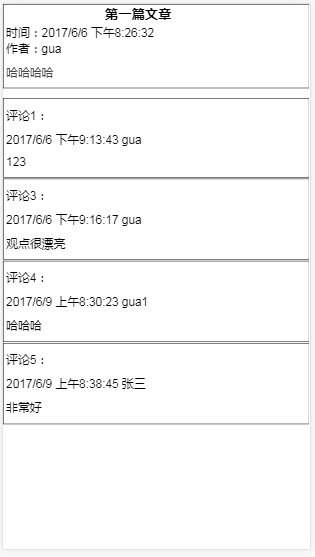

```
# ndoe-express博客程序


```
使用下面的功能实现博客程序
node
express
ajax


文件分布如下
- appBlog.js        后端程序主文件
- blog.js           处理 blog 数据存取的文件
- blog.json         存储 blog 数据的文件(相当于数据库)
- blog_index.html   博客主页的 html 文件
- blog_detail.html  博客详情页面 html 文件


运行程序方式如下
node appBlog.js
```

//////////////////////////////////////////////
//	@author: 姜奇 (604799292@qq.com)
//	@version: 1.0.0.1 2018.10.22 新增mongodb模块，可以实现查找，增加，删除，修改内容
              1.0.0.2 2018.10.25 安装Mongoose，来使用mongodb
              1.0.0.3 2018.12.05 新增_引入cors模块，用来处理跨域请求的问题
              1.0.0.4 2018.12.19 新增_用来手机上传错误的接口（/list/addError）
              1.0.0.5 2018.12.19 新增_查找一条id的接口
              1.0.0.6 2018.12.19 新增_在返回的数据中，新增一个时间的字段
              1.0.0.7 2019.1.9 新增_请求接口再写入json文件
              1.0.0.8 2019.1.9 新增_请求post和get，再写入json文件

//////////////////////////////////////////////
备注：
1.Mongoose操作schema时默认表名添加s以及解决
module.exports = mongoose.model('Page',userSchema,"name");


2.---12.19新增post接口请求（onError）
    2.1在route\list.js中添加接口名字
    //12.19新增一个post请求,存储错误信息
    var addError = {
        path: '/list/addError',
        method: 'post',
        func: function(request, response) {
            // 浏览器发过来的数据我们一般称之为 form (表单)
            var form = request.body
            var errorMsg = form.e
            //这里是传递的数据
            var data = comment.new({
                author: 'jq',
                content: '1220561194@qq.com',
                blog_id: '2',
                errorMsg: errorMsg,
            })
            data.then(function(comments) {
                var r = JSON.stringify(comments)
                response.send(r)
            })
        }
    }
    var routes = [
    //...
        addError,
    ]
    2.2在userModel.js中添加新的字段
    {
        errorMsg: String,
    }
    2.3在model\list.js中
    // 在数据中，用来存储 comment 数据的对象
    const ModelComment = function(form) {
        //...
        //12.19新增一个字段，然后上传过去
        this.errorMsg = form.errorMsg || ''
    }

3.查找用户数据的时候，如果需要加上自己想要的字段，需要在userModel.js中先添加新的字段，否则无法生效
```
